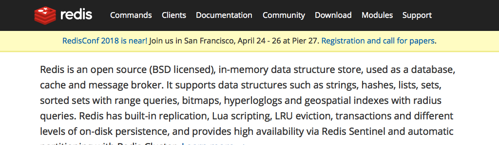

# Redis简介

[Redis][]是一个开源，高级的键值存储和一个适用的解决方案，用于构建高性能，可扩展的Web应用程序。

Redis有三个主要特点，使它优越于其它键值数据存储系统：

- Redis将其数据库完全保存在内存中，仅使用磁盘进行持久化。

- 与其它键值数据存储相比，Redis有一组相对丰富的数据类型。

- Redis可以将数据复制到任意数量的从机中。

## Redis的优点

- 异常快 - Redis非常快，每秒可执行大约`110000`次的设置(SET)操作，每秒大约可执行`81000`次的读取/获取(GET)操作。

- 支持丰富的数据类型 - Redis支持开发人员常用的大多数数据类型，例如列表，集合，排序集和散列等等。这使得Redis很容易被用来解决各种问题，因为我们知道哪些问题可以更好使用地哪些数据类型来处理解决。

- 操作具有原子性 - 所有Redis操作都是原子操作，这确保如果两个客户端并发访问，Redis服务器能接收更新的值。

- 多实用工具 - Redis是一个多实用工具，可用于多种用例，如：缓存，消息队列(Redis本地支持发布/订阅)，应用程序中的任何短期数据，例如，web应用程序中的会话，网页命中计数等。

## Redis与其他键值存储系统

- Redis是键值数据库系统的不同进化路线，它的值可以包含更复杂的数据类型，可在这些数据类型上定义原子操作。

- Redis是一个内存数据库，但在磁盘数据库上是持久的，因此它代表了一个不同的权衡，在这种情况下，在不能大于存储器(内存)的数据集的限制下实现非常高的写和读速度。

- 内存数据库的另一个优点是，它与磁盘上的相同数据结构相比，复杂数据结构在内存中存储表示更容易操作。 因此，Redis可以做很少的内部复杂性。

[redis]: https://redis.io/
