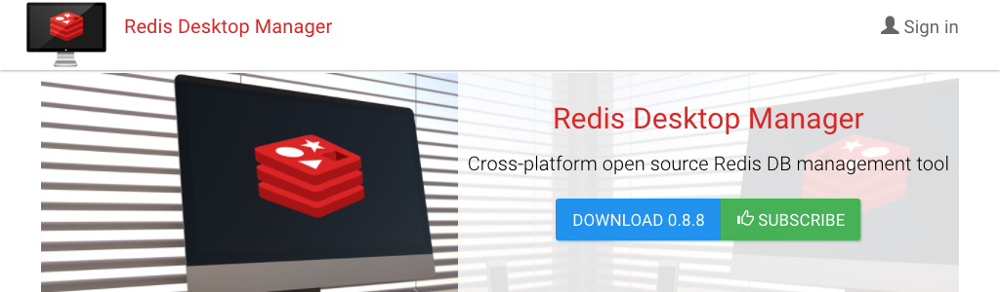
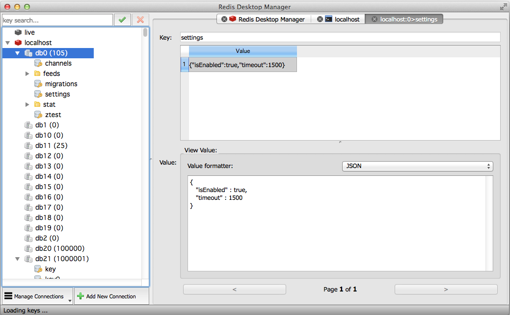

# Redis GUI工具

[Redis Desktop Manager][RDM]（RedisDesktopManager，RDM）是一个快速、简单、支持跨平台的[Redis][]桌面管理工具，基于Qt5开发，支持通过`SSH Tunnel`连接。

## 支持的平台

* Windows7+
* Mac OSX 10.10+
* Ubuntu14.04 & Ubuntu16.04
* Fedora
* CentOS
* OpenSUSE

[Redis]: https://redis.io/
[RDM]: https://redisdesktop.com/
